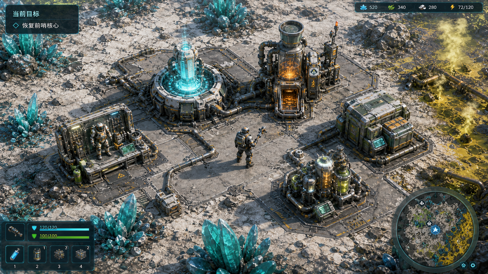
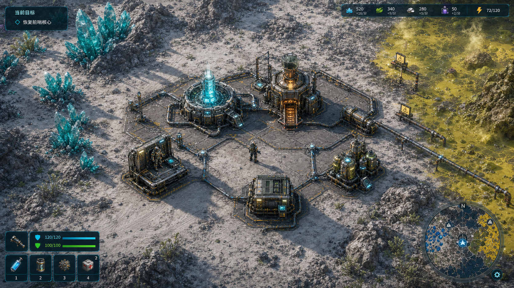

# Demo Playable UI And Art Pass V1

更新时间：2026-06-25

## 用途

本文定义首版可玩纵切的 UI 与低保真美术执行范围。目标是让玩家第一眼看到的是游戏画面，而不是开发面板、调试色块和全图流程图。

## 玩家价值

玩家不需要读长说明，也应能判断：

- 我在哪个区域。
- 哪个对象可以操作。
- 哪些设备属于基地。
- 哪些区域危险。
- 当前目标、生命、防护、补给和关键材料是否足够。

## 与整体规划的关系

- 服务 [Demo First Playable Slice Assembly V1](demo-first-playable-slice-assembly-v1.md)。
- 承接 [Visual And UI Direction](../product/visual-and-ui-direction.md) 的工业科幻现场界面方向。
- 接管 [Demo Industrial Base Visual And Scene V1](demo-industrial-base-visual-and-scene-v1.md) 中未完全解决的视觉主读法问题。

## 当前已有基础

- HUD 已有目标、生命 / 防护、关键材料、地图、快捷补给、设备面板和保存 / 基线面板。
- 基地、晶体、污染、核心稳定站已有低保真图层、状态灯、物料槽和短流线。
- 角色和敌人已有程序绘制轮廓，但仍偏原型符号。

## 2026-06-23 第一包

- 已新增默认玩家快捷补给面板，把 `1 / 2` 补给状态从开发绑定 / GM 面板中抽出。
- `TAB` 仍保留存档、开发基线、截图定位、快捷绑定和 GM 控件；默认第一视野不显示这些开发面板。
- 已补静态和 Godot 运行时检查，确认默认 HUD 显示玩家补给，开发面板打开时不会覆盖快捷补给。

## 2026-06-23 第二包

- 已将默认底部交互提示压缩为一行目标 / 操作摘要，长用途、状态和下一步不再直接铺满画面。
- 已将底部行动日志压缩为一行结果摘要，完整文本保留为 HUD 元素 tooltip，设备面板和完成反馈继续承担详细说明。
- 已补 Godot 运行时检查，确认长 prompt / log 不含换行且受长度上限约束。

## 2026-06-23 第三包

- 已给玩家、敌人和关键交互对象补低保真语义轮廓：玩家增加面罩、状态灯和工具尖端，敌人增加威胁眼和类别棘刺。
- `PrototypeInteractable` 现在委托 `PrototypeInteractableSemanticSilhouette`，按 `definition_id` 为前哨核心、基础反应器、储存箱、出发整备台、污染过滤器、晶体采集器和核心写入设备绘制本地剪影、端口和状态灯。
- 已补 `demo_prototype_visual_pass_check.gd`，覆盖九类关键对象的语义轮廓 ID 与局部结构，不新增区域、资源、配方、任务链或 UI 组件库。

## 2026-06-23 第四包

- 已给采集器、入料口、基础反应器、储存箱、整备台、污染过滤器、浆液回流点和核心写入设备补低保真操作关系标记。
- 关系表达使用短流线、端口框、状态节点和材质色，复用现有场景视觉层，不新增区域、资源、配方、长期系统或新 UI 组件库。
- 已补资源链、污染边界和核心稳定站检查，确认这些对象用途关系能在默认可玩画面对应视觉层注册。

## 2026-06-23 第五包

- 已将当前目标读法从跨屏路线进一步收为本地工作面焦点：目标对象周围显示轻量角框、端口点和阶段刻度，近距离才显示玩家到目标的短连线。
- 核心写入设备接入同一套目标解析，核心稳定站内继续使用局部焦点，不恢复长目标路线或大标签。
- 已补 `demo_prototype_visual_pass_check.gd`，覆盖启动核心、第一工业路径、污染边界和核心写入四段默认画面的本地焦点模式。

## 2026-06-24 第六包

- 已按 1 到 6 号截图复核结果做局部画面收束：2 号晶体矿脉强化矿面、矿岛和碎矿片，压低区域价值块、场景深度层和大边框；5 号污染边界压低外部上下文和关系线密度。
- 第一工业路径同时下调跨区边框、远区价值块和非当前区域层，降低 3 / 4 号位背景干扰。
- 已收紧晶体、第一工业路径和污染边界检查阈值，防止区域块、大边框和跨屏路线重新成为默认画面主信号。
- 2 号晶体矿脉补充收束：晶体资源焦点和第一工业路径焦点会直接压低 `RegionCrystal` / `RegionPollution` 旧区域矩形与 `RegionBoundary*` 边框，让矿面、采集器托盘和短关系线压过蓝 / 黄大块上下文。

## 2026-06-24 第七包

- 默认 HUD 新增常驻行动状态条，从当前目标、交互 prompt、运行提示和最近行动日志提取两行短读法。
- 行动状态条只做现场行动聚焦，不新增任务、区域、资源、配方、存档字段或全屏提示。
- 设备面板状态区前置 `现场状态`、`输入输出` 和 `下一步`，让玩家先读设备当前用途、原料 / 产物关系和可执行动作，再看详细配方列表。
- 已补默认 HUD 行动状态条、设备面板结构和跨平台静态检查，确认开发面板仍默认隐藏。

## 当前口径修正

- 本专题下一步优先解决“不像游戏”：默认画面要从 debug 流程图 / 原型图层转向可玩的 2D / 2.5D 工业科幻 ARPG 场景。
- 主线工作优先级：角色形体与朝向、敌人威胁姿态、设备机器感、地面材质、阴影与空间层次、操作动作反馈、场景氛围。
- HUD、读法、状态整理、设备面板字段和检查补充只能支撑画面成型；如果它们没有让画面更像游戏，就不算本专题下一步主线。
- 在默认画面明显像游戏前，不转向完整路径体感复核、试玩准备或验收。

## 2026-06-24 第八包：启动界面与基地首屏第一印象

- 启动界面先承担第一眼游戏气质：低保真受损前哨背景、工业管线、核心灯、污染远景和稳定工程剪影。
- 菜单项为 `新游戏`、`载入存档`、`联机（暂不开放）`、`设置`、`退出`；`联机（暂不开放）`置灰，不开发真实联机。
- `设置`只保留轻量入口和返回，不扩完整设置系统；`载入存档`沿用默认槽位，不新增存档字段。
- 进入新档后继续让基地首屏的角色、设备、地面、材质、阴影和操作反馈承接同一套工业科幻第一印象。

## 2026-06-25 第九包：基地首屏低保真游戏画面成型

- 新游戏进入后的基地首屏新增低保真工作现场 pass：前哨平台地面板缝、局部阴影、断供痕迹、玩家工具站位和设备周边反馈先形成可玩的工作面。
- 玩家工程战斗员补肩甲、工具背带、前后工具支撑、前倾靴位和头灯读法；方向、工具端和角色形体更接近 ARPG 可操作角色。
- 前哨核心、基础反应器、储存箱和整备台补机器底座、夹具、进料斗、排气、出料托盘、货盘、锁扣灯、服架和工具托架；设备不再只靠色块或流程节点表达。
- 已补 `demo_prototype_visual_pass_check.gd`，覆盖基地首屏地面 / 阴影 / 断供痕迹、关键设备机器细节、玩家姿态和局部反馈；未新增区域、任务、资源、配方、存档字段或完整菜单 / 设置系统。

### 首屏参考图





- 近景图作为第九包后的设备读法参考：保留左上当前目标、右下小地图、左下角色状态 / 快捷栏和右上少量资源，默认不展开大任务表、建造菜单、开发面板或全屏地图。
- 高视角图作为下一轮取景参考：适当抬高机位、扩大基地周边缓冲，让晶簇和污染区离核心平台更远，避免首屏读成局部设备特写。
- 两张图共同固定化工前哨核心、基础反应器、储存、整备、污染过滤、晶体生态和黄色污染边界的同屏读法；不要照搬其他游戏的围墙、炮塔阵列或大规模防御基地结构。

## 2026-06-25 第十包：基地首屏取景与常驻 HUD 收束

- 默认相机略微拉远，让新档首屏更接近高视角 2.5D 基地取景，而不是只贴着前哨核心和玩家站位。
- HUD 默认布局改为左上当前目标、右下小地图、左下快捷补给、右上生命 / 防护 / 关键状态；开发面板、绑定面板、大任务表和建造菜单仍默认隐藏。
- 小地图从左上路线条改为右下紧凑地图块，只显示当前 / 目标等高价值标签，普通区域标签不常驻铺开。
- 恢复前哨核心前，基地视觉层会压低旧区域色块、跨屏路线、远区规划层和非核心交互标记，避免首屏继续读成 12 区流程图。
- 已同步首小时 HUD / 相机检查和视觉 pass 检查；未新增区域、任务、资源、配方、存档字段或完整地图系统。
- 首屏实机复核结论：角落 HUD 方向成立，但远区黑场、竖向边界、蓝色横带和规划矩形仍抢主读法，基地工作面像浮在调试地图上的小岛；下一包先处理这些残余规划层和空场。

## 2026-06-25 第十一包：基地首屏残余规划层与空场收束

- 恢复前的新档首屏不再绘制覆盖半屏的大暗矩形，改用前哨核心周边局部工作场缓冲、软边缘和低亮服务线，让基地工作面不再浮在规划图上。
- `DemoSceneFocusDepthLayer` 在前哨核心恢复前持续压低旧 `Region*`、`RegionBoundary*`、主路线脊柱和蓝色路线带，避免后续 `_process` 把竖向边界、蓝色横带和远区区域块重新抬回首屏。
- 右下小地图保留完整 12 区数据来源，但默认运行时只显示基地、晶体、污染、核心，以及当前 / 目标类高价值 marker；深段锁定点不再铺满首屏小地图。
- 已同步视觉 pass、HUD 首小时和小地图检查；未新增区域、任务、资源、配方、存档字段、完整地图系统或试玩验收。
- 后续实机截图确认：首屏规划层收束方向成立，但晶体 / 校准阶段仍被第一工业路径、旧区域边界和底部弱提示压住，玩家无法判断当前交互。

## 2026-06-25 第十二包：晶体局部交互与第一路径退场

- 晶体手采、废件和采集器输出所在的局部工作面由 `DemoCrystalResourceVisualLayer` 承担主读法，第一工业路径在该范围隐藏完整路径层，不再把跨屏路线、大暗场和区域框叠到矿场画面上。
- 当前目标仍保留第一路径的短焦点模式：逻辑目标、局部目标框和短提示继续工作，但不恢复跨屏目标线或大标签。
- 当前可交互对象在晶体工作面恢复可读标签、焦点圈和放大 marker，底部交互提示加宽并提高对比度，让玩家能直接判断“对象”和“按键”。
- 已同步资源链、视觉 pass 和首小时 HUD 检查；未新增区域、任务、资源、配方、存档字段、完整地图系统或试玩验收。
- 后续先实机复核新档首屏和晶体局部交互；若成立，再把同一低保真机器 / 材质语言延伸到基地入料、反应器和整备交接段。

## 本轮范围

1. HUD 玩家化：
   - 默认隐藏开发基线、GM 资源控制和长调试日志。
   - 固定显示生命、防护、补给、快捷物品、当前目标和关键缺料。
   - 设备面板只展示当前设备的输入、输出、进度、阻塞原因和下一步。

2. 核心对象低保真资产：
   - 玩家：前哨工程战斗员轮廓、头盔、背包、工具方向。
   - 敌人：原生、污染、守卫三类基础轮廓。
   - 设备：前哨核心、基础反应器、污染过滤器、储存箱、整备台、采集器、核心写入设备。
   - 场景：基地地面、晶体矿面、污染处理工作面、核心站平台。

3. 视觉层级收束：
   - 核心路径内不显示跨屏长路线、区域大边框和非当前目标标签。
   - 用短标签、图标、描边、局部 halo 和状态灯替代大段文字。
   - 保留开发截图入口，但不能主导默认第一视野。

## 当前不做

- 不做最终美术包、完整动画、完整菜单、完整设置系统或 UI 组件库。
- 不重画 12 区全部资产。
- 不继续靠增加透明层和提示文字解决主体识别问题。
- 不开发真实联机；启动界面只保留置灰入口。

## 玩家操作路径

本专题只覆盖纵切路径中玩家必看的画面：

```text
基地首屏 -> 晶体矿脉 -> 基地入料 / 反应器 -> 污染边界 -> 核心稳定站 -> 结尾反馈
```

## 运行时、存档与数据边界

- 视觉节点和 UI 布局默认不进入存档。
- 若新增场景状态，只能读取既有任务、建筑、库存、敌人和区域状态。
- 开发面板保留，但默认隐藏或折叠。

## HUD / 场景 / 对象反馈

- HUD 第一视野像 ARPG + 工业现场界面，而不是后台管理系统。
- 基地设备之间要有输入输出关系：入料、加工、储存、整备。
- 污染区要显示危险和处理对象，不只是黄绿色区域。
- 核心站要显示写入、复测、回流和压力解除。

## 验收条件

- 截图不看任务文本也能识别基地、晶体、污染、核心站。
- 玩家能说出 5 个基地核心设备和它们大致用途。
- HUD 默认画面没有被开发基线、GM 控件或长日志主导。
- 角色、敌人、资源、设备不再主要是无语义方块 / 圆点。

## 验证计划

- `sh ./scripts/check-client.sh`
- 涉及 Godot runtime 接线时执行 `sh ./scripts/check-client.sh --with-godot`
- `./scripts/check-docs.sh`
- `./scripts/check-text-files.sh`
- `git diff --check`

## 风险与后续决策

- 若低保真资产仍像流程图，应优先补对象轮廓和场景材质，不继续加提示。
- 若 UI 信息过密，应先隐藏开发信息，再压缩玩家不需要的生产细节。
- 若下一步建议落到读法、UI 字段、状态整理或设备面板字段，应先回到“画面是否像游戏”的门槛重新判断。
